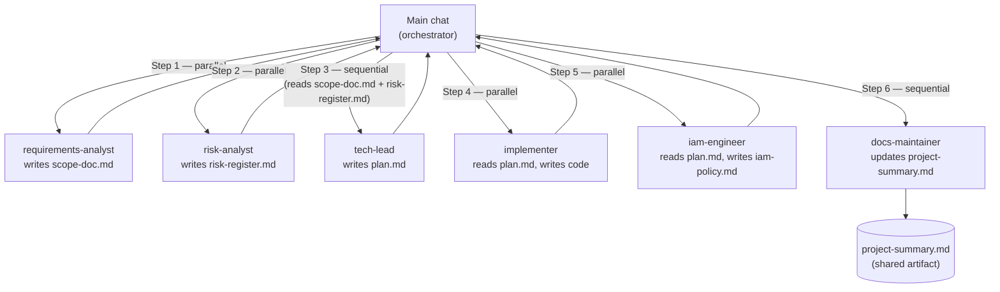

Companion to [readme.md](readme.md), [readmecli.md](readmecli.md), [vscodeaicheatsheet.md](vscodeaicheatsheet.md), and [tokenmonitoring.md](tokenmonitoring.md).

---

# Claude Code Subagent Best Practices

A cheat sheet and reference library for building, invoking, and composing Claude Code subagents — from first principles to a full agent bench.

---

## 1. What this is / how to read it

This guide is for developers who are new to subagents. No prior experience with AI agents is assumed — every concept is explained before it is used.

**What is a subagent?** A subagent is a pre-configured Claude instance with a single job, its own instructions, a restricted set of tools, and a chosen model. Think of each one as a specialist contractor: you hand them a well-scoped task, they do it, and they hand results back.

**How this guide fits with the others:**

| Topic | Where to read it |
|---|---|
| Model routing (opus/sonnet/haiku), token efficiency, SDLC overview | [readme.md](readme.md) |
| CLI commands, slash commands, MCP, headless automation | [readmecli.md](readmecli.md) |
| Using agents inside VS Code | [vscodeaicheatsheet.md](vscodeaicheatsheet.md) |
| Measuring the token cost of your agent runs | [tokenmonitoring.md](tokenmonitoring.md) |
| Building agents, invoking them, composing them | **This file** |

**How to read this guide:** Sections 2–5 are the concepts (why, anatomy, invocation, interaction). Section 6 covers automations. Section 7 is a design cheat sheet. Section 8 is a library of agent ideas you can copy and adapt. Sections 9–10 are quick-reference and glossary.

---

## 2. Why build agents?

### The plain-language case

Running everything in one long main-chat session has a cost: the conversation grows, context fills up, and Claude starts losing track of earlier decisions. A subagent solves this by running in its own separate context window. It does its job cleanly, returns a result, and disappears. The main chat stays lean.

Beyond context hygiene, agents give you:

- **Focused expertise.** A prompt engineer, a security reviewer, and a planner all live in one brain if you just ask in the main chat — that brain has to guess which hat to wear. An agent has one hat and wears it consistently.
- **Reusability across projects.** Agents stored at user scope (`~/.claude/agents/`) are available in every project without re-explaining anything.
- **Least-privilege safety.** A documentation agent that has no Bash access cannot accidentally delete files. Restricting tools limits the blast radius of mistakes.
- **Parallelism and speed.** Independent agents can run at the same time. Parallel runs that complete within the 5-minute prompt-cache window are both faster and cheaper (see [tokenmonitoring.md](tokenmonitoring.md) for the cache-window explanation).
- **Consistent outputs.** An agent with a fixed output format produces the same shape of result every time, which makes it easy to feed one agent's output into the next agent's input.

### When a subagent helps vs. when to just ask in the main chat

| Situation | Better choice | Why |
|---|---|---|
| Task matches a clear specialist role (review, plan, document, build) | Subagent | Focused expertise, separate context, reusable |
| Quick one-off question about code you are already looking at | Main chat | No setup cost; context is already there |
| Task requires deep context from the current conversation | Main chat (pass a summary to an agent if needed) | Agents start cold — they have no session memory |
| Multi-step job touching multiple roles | Planner agent → specialists | Planner produces a delegation table; you run specialists in order |
| Repeating the same task across many projects or on a schedule | Subagent + headless `claude -p` | Automatable; consistent; scriptable |
| Exploring an idea casually | Main chat | Lower overhead; no need to scope a task formally |

---

## 3. Anatomy of an agent (how to build one)

### The file format

Every subagent is a single Markdown file. The top section (between the `---` lines) is called **YAML frontmatter** — it is the machine-readable part that tells Claude Code how to configure the agent. Below the frontmatter is the agent's **system prompt**: free-text instructions that define its role, what it should and should not do, and what format its output should take.

### The template

```markdown
---
name: example-agent
description: Use this agent to <do X>. Triggers: "<phrase>", "<phrase>". Prefer <other-agent> when <condition>.
tools: Read, Grep, Glob, Write, Edit
model: sonnet
---

You are <role>. Your job is <one clear responsibility>.
- <key instruction>
- <constraint / what NOT to do>
Output: <expected format>.
```

### Field-by-field explanation

**`name`** — The agent's identifier. Use kebab-case (all lowercase, words separated by hyphens). This is what you type when you invoke the agent. Example: `code-reviewer`, `risk-analyst`, `tech-lead`.

**`description`** — The most important field. Claude reads every agent's description to decide which one to pick when you do not specify one explicitly (called auto-delegation). A good description answers two questions: "when should I choose this agent?" and "when should I choose something else instead?"

**`tools`** — A comma-separated list of the tools this agent is allowed to use. Omit the field entirely to inherit all tools. Keep this as short as possible — this is least privilege in practice: give the agent only what it genuinely needs. An agent that only reads and summarizes files does not need `Bash` or `Edit`.

**`model`** — Which model runs this agent. Use `opus` for deep-reasoning tasks (planning, security architecture, incident response), `sonnet` for everyday workhorses (coding, documentation, most authoring), and `haiku` for fast/cheap bulk tasks (classifying, pre-filtering). Use `inherit` to follow whatever model is set in the main session. Full model routing guidance is in [readme.md](readme.md).

**Body (system prompt)** — The agent's standing instructions. Be specific about role, responsibility, what not to do, and output format. Short and focused is better than long and vague.

### Good vs. weak description

| | Example |
|---|---|
| **Weak** | `Use this agent for code reviews.` |
| **Good** | `Use this agent to review a pull request or a specific file for bugs, style violations, and security issues. Triggers: "review this file", "code review", "check for issues". Prefer the security-reviewer agent when the review is specifically about authentication, secrets, or vulnerability analysis.` |

The weak description tells Claude almost nothing. The good description tells it when to use this agent, what phrases should trigger it, and when to pick a different agent instead.

### Where to store agents

| Scope | Location | Who can use it |
|---|---|---|
| **User scope** | `~/.claude/agents/<name>.md` | You, in every project on this machine |
| **Project scope** | `.claude/agents/<name>.md` (inside a repo) | Anyone who clones the repo |

Use user scope for personal reusable agents. Use project scope when you want the whole team to share an agent, version-controlled alongside the codebase.

### Managing agents

Type `/agents` inside the Claude Code REPL to list, inspect, create, and manage your agents interactively. This is the recommended starting point — no manual file editing required until you need fine-grained control.

---

## 4. How to reference and invoke agents well

### The invocation grammar

The standard way to call an agent from the main chat is:

```
Use the `<name>` subagent to <self-contained task description>.
```

Examples:

```
Use the `code-reviewer` subagent to review C:\Projects\myapp\auth.js for security issues. Focus on token validation and session handling.
```

```
Use the `tech-lead` subagent to produce a delegation plan for adding a user-authentication module to the app described in C:\Projects\myapp\CLAUDE.md.
```

```
Use the `risk-analyst` subagent to read C:\Projects\myapp\threat-model.md and produce a risk register in Markdown table format.
```

### Auto-delegation

If you do not name an agent explicitly, Claude reads all agent descriptions and tries to pick the best match for your request. This is called auto-delegation. It works well when your descriptions are precise and include trigger phrases. It fails silently when descriptions are vague — Claude either picks the wrong agent or falls back to answering in the main chat.

The practical rule: name the agent explicitly for important tasks. Use auto-delegation for quick, low-stakes requests where getting the "second-best" agent is acceptable.

### The cold-start rule (always pass full context)

**Agents start cold.** Every time you invoke a subagent, it begins with zero memory of your current session, your project, or anything discussed before. It only knows what you give it in the invocation message.

This means every invocation must include:

- The file path(s) the agent needs to read
- The goal of the task
- Any decisions already made that the agent needs to respect
- The expected output format, if it matters

Do not assume the agent "knows" anything from your session. If you want it to know something, say it in the message.

### Tips for self-contained task prompts

- **One task per invocation.** Agents do one thing well. Asking a single agent to "build the feature, write the tests, and update the docs" produces worse results than three focused invocations.
- **State the output format.** "Return a Markdown table with columns: Risk, Likelihood, Impact, Mitigation" is better than "tell me about the risks."
- **Tell the agent what not to do.** If there is a common mistake the agent might make, name it: "Do not edit any files — read only and report."
- **Pass prior outputs as context.** If a planner agent already produced a plan, paste the relevant section of that plan into the specialist agent's invocation so it has the decisions it needs.

### Naming conventions

- Use kebab-case: `tech-lead`, `code-reviewer`, `risk-analyst`
- Name for the role, not the task: `implementer` not `write-code`
- Keep names short enough to type comfortably

---

## 5. How agents interact with each other

### The no-deep-nesting rule

A subagent cannot call another subagent. If Agent A tries to invoke Agent B, the chain breaks — silently, without an error message. There is only one orchestrator in a Claude Code workflow: **the main conversation**.

This is not a limitation to work around — it is a design principle. The main chat is where decisions get made. Agents are specialists who execute decisions, not managers who delegate to other managers.

### The orchestrator model

The flow is always:

```
Main chat (orchestrator) → Agent A (specialist)
Main chat (orchestrator) → Agent B (specialist)
Main chat (orchestrator) → Agent C (specialist, given outputs of A and B)
```

Never:

```
Agent A → Agent B → Agent C   ← this does not work
```

You, in the main chat, are the project manager. You read each agent's output, decide what comes next, and fire the next agent with the right context.

### The planner + delegation table pattern

For multi-step work, start with a planner agent (see the tech-lead example in Section 8). The planner's job is to:

1. Read the project goal and any existing artifacts (brief, CLAUDE.md, prior docs)
2. Produce a **delegation plan table**: a structured breakdown of what needs to happen, in what order, and which agents should do each step
3. Flag which steps can run in parallel (independent of each other) and which must wait

Example delegation plan table (what a planner should output):

| Step | Specialist | Task | Depends on | Parallel? |
|---|---|---|---|---|
| 1 | requirements-analyst | Draft scope document from project brief | — | Yes (with step 2) |
| 2 | risk-analyst | Identify risks from the project brief | — | Yes (with step 1) |
| 3 | tech-lead | Review scope + risks; produce architecture plan | Steps 1, 2 | No |
| 4 | implementer | Build the auth module per the architecture plan | Step 3 | Yes (with step 5) |
| 5 | iam-engineer | Define IAM roles for the auth module | Step 3 | Yes (with step 4) |
| 6 | test-engineer | Write tests for the auth module | Steps 4, 5 | No |
| 7 | code-reviewer | Review implementation and tests (read-only) | Step 6 | No |
| 8 | docs-maintainer | Update project-summary.md to reflect the new module | Step 7 | No |

After the table, ask the planner to output ready-to-paste invocation lines for each step so you can fire them directly.

**How to execute the plan:**

1. Fire all "Parallel? = Yes" steps in the same message or in rapid succession (within the 5-minute cache window).
2. Wait for those to complete.
3. Fire the next sequential step, passing in the outputs from the completed steps as context.
4. Repeat until done.

Parallel steps that complete within the same cache window are both faster and cheaper. See [tokenmonitoring.md](tokenmonitoring.md) for the cache-window mechanics.

### Handoff via shared artifacts on disk

When agents need to pass information to each other, they do it through files — not through a direct call. This is called **handoff via shared artifacts**.

The pattern:

- The planner agent writes `plan.md` (or returns its plan as text you save)
- The implementer reads `plan.md` to understand what to build
- The test-engineer reads both the implementation files and the plan
- A docs agent reads all prior outputs and updates `project-summary.md`

**`project-summary.md` as a source of truth.** A common convention (described in detail in [readme.md](readme.md)) is to maintain a single `project-summary.md` that tracks what the project does, what decisions have been made, and what the current status is. Each agent that completes a phase can contribute a fragment; a docs-maintainer agent assembles and keeps the file current. Any future agent can read this file to get oriented without needing to re-read the whole conversation history.

### How it looks as a diagram



---

## 6. Automations with agents

### Headless runs in scripts and CI

Headless mode runs Claude with a single prompt and exits — no interactive session. The output goes to stdout, which you can pipe, log, or use in a script. This is how you use agents in automation pipelines.

Basic pattern (from the terminal or a script):

```powershell
claude -p "Use the code-reviewer subagent to review C:\Projects\myapp\auth.js for security issues and return a summary."
```

Saving output to a file:

```powershell
claude -p "Use the code-reviewer subagent to review C:\Projects\myapp\auth.js for security issues." > C:\Projects\myapp\review-output.txt
```

In a CI pipeline (e.g., a GitHub Actions step or a build script), you can wire this into any stage that produces files to review — a linting step, a pre-commit hook, or a nightly report.

See [readmecli.md](readmecli.md) for full CLI reference and the headless-mode section.

### Slash commands for review automation

Several built-in slash commands are wired to agent-like review workflows. Type these inside the Claude Code REPL:

| Slash command | What it does |
|---|---|
| `/code-review` or `/review` | General code quality review on specified files |
| `/security-review` | Security-focused review (auth, secrets, user input handling) |
| `/init` | Scaffolds a `CLAUDE.md` in the current project |

These do not require you to have a custom agent defined — they are built in. Use them for quick reviews without the setup cost of a named agent invocation.

### Scheduled / overnight runs

You can schedule headless agent runs using your operating system's task scheduler. On Windows, use Windows Task Scheduler.

```powershell
# Run a headless review every morning at 8:00 AM
$action = New-ScheduledTaskAction -Execute "claude" -Argument '-p "Use the code-reviewer subagent to review C:\Projects\myapp\src for any new TODO comments and log findings." >> C:\Projects\myapp\logs\daily-review.txt'

$trigger = New-ScheduledTaskTrigger -Daily -At "08:00AM"

Register-ScheduledTask -TaskName "ClaudeDailyReview" -Action $action -Trigger $trigger -RunLevel Highest
```

> **Reality-check: the session-only cron caveat.** Claude Code has a built-in `/schedule` command and `CronCreate` task feature. On some installs (including where the feature flag `tengu_kairos_cron_durable` is `false`), these tasks are session-only — they disappear the moment you close the app. Do not rely on `/schedule` for overnight or unattended runs. Use Windows Task Scheduler (or a CI/CD platform like GitHub Actions) for durable, scheduled automation. See [readmecli.md](readmecli.md) for the full cron caveat.

### Parallel fan-out

When a planner's delegation table identifies parallel steps, you can fire them simultaneously from the main chat. The most efficient way is to send both invocations in the same message:

```
Use the `requirements-analyst` subagent to draft a scope document from C:\Projects\myapp\brief.md.

Also use the `risk-analyst` subagent to identify risks from the same brief and return a risk table.
```

Claude Code can dispatch both agents at once. Results arrive independently; you collect both and feed them into the next sequential step.

### Plan-then-execute

The cleanest way to start any non-trivial task:

1. Ask the main chat (or a planner agent) to produce a plan before touching any file.
2. Review the plan.
3. Execute steps in order, using specialists for each one.

This is "plan mode" — Claude researches and produces a plan, you approve it, then execution begins. Any ambiguity caught at plan time costs almost nothing. The same ambiguity caught after an agent has rewritten three files costs a full re-run.

### Automation patterns — summary table

| Automation | How | When to use |
|---|---|---|
| CI/CD review step | `claude -p "Use the code-reviewer subagent to ..."` in a pipeline script | On every PR or push |
| Nightly report | Windows Task Scheduler + `claude -p "..."` | Daily summaries, drift detection, cost reports |
| Parallel fan-out | Send multiple agent invocations in one main-chat message | When the delegation table shows independent steps |
| Plan-then-execute | Ask for a plan first; execute only after approval | Any multi-file or multi-step task |
| Quick in-session review | `/code-review` or `/security-review` slash command | Fast checks during active development |
| Drift audit | Schedule a docs-maintainer run to compare docs vs. code | After each major phase or milestone |

---

## 7. Agent design cheat sheet

| Do | Don't |
|---|---|
| Give each agent one clear responsibility | Give one agent multiple unrelated jobs |
| Write the `description` to drive selection — say when to use it AND when to prefer another agent | Leave the description vague ("use this for stuff") |
| Apply least privilege: only list the tools the agent actually needs | Give every agent all tools by default |
| Match `model` to the task: opus for deep reasoning, sonnet for everyday work, haiku for bulk/cheap tasks | Run all agents on opus regardless of need |
| Include all needed context in the invocation (file paths, goal, prior decisions) | Assume the agent remembers anything from your session |
| Use the main chat as the orchestrator | Try to make one agent call another |
| Run parallel steps inside the 5-minute cache window | Fire parallel steps hours apart, one at a time |
| Use shared artifacts (files on disk) for agent-to-agent handoffs | Try to pass context through nested agent calls |
| Include "Prefer `<other-agent>` when `<condition>`" in the description | Leave Claude to guess which agent to pick for edge cases |
| Use project-scope agents for team-shared specialists | Rely on only user-scope agents in a shared codebase |

---

## 8. Agent ideas and examples library

This section gives you a starting template for each major domain. For each one you will find: a one-line purpose, the recommended model and tools with rationale, 2–3 trigger phrases, and an example frontmatter block you can copy and adapt.

The system-prompt body shown in each example is intentionally brief — expand it to match your actual requirements.

---

### Development — general feature implementer

**Purpose:** Write, edit, and refactor application code for a specific feature or fix.

**Model:** `sonnet` — solid code generation at everyday cost; no deep reasoning required for most build tasks.

**Tools:** `Read, Grep, Glob, Write, Edit, Bash` — needs Bash to run build/test commands and confirm the change worked.

**Least-privilege rationale:** This is a "doer" agent — it builds things, so it needs Write, Edit, and Bash. Scope it to the project directory; it has no reason to touch files outside the repo.

**Trigger phrases:** "implement this feature", "build the module", "write the code for"

```markdown
---
name: implementer
description: Use this agent to write, edit, or refactor application code for a specific feature or bug fix. Triggers: "implement this feature", "build the module", "write the code for". Prefer the code-reviewer agent when you only need a review without changes. Prefer the debugger agent when diagnosing a failure without writing new code.
tools: Read, Grep, Glob, Write, Edit, Bash
model: sonnet
---

You are a software implementer. Your job is to write correct, readable code for one clearly scoped feature or fix at a time.
- Read relevant files before writing anything.
- Make the minimum change needed to satisfy the requirement.
- Do not refactor unrelated code in the same pass.
- After writing, run any available tests and report the result.
Output: the changed files (via Edit/Write) plus a short summary of what you changed and why.
```

---

### UI/UX — interface design and accessibility

**Purpose:** Design user interfaces, evaluate interaction flows, check accessibility compliance, and translate design decisions into code or structured specs.

**Model:** `sonnet` — balanced quality for structured authoring and code generation.

**Tools:** `Read, Grep, Glob, Write, Edit` — authoring and design-to-code work; Bash not required for spec authoring; add Bash if the agent will run a dev server or accessibility linter.

**Least-privilege rationale:** Primarily an authoring agent. Add Bash only if it needs to run tools (e.g., an a11y linter).

**Trigger phrases:** "review this UI", "check accessibility", "design the interface for"

```markdown
---
name: ui-ux-designer
description: Use this agent to design or evaluate user interfaces, check accessibility (WCAG compliance), and translate designs into component code or structured specs. Triggers: "review this UI", "check accessibility", "design the interface for". Prefer the implementer agent when the task is writing production backend logic.
tools: Read, Grep, Glob, Write, Edit
model: sonnet
---

You are a UI/UX specialist. Your job is to design clear, accessible, user-centered interfaces and translate designs into implementable specs or component code.
- Always evaluate designs against WCAG 2.1 AA accessibility guidelines.
- Flag interaction patterns that create confusion or cognitive load.
- When writing component code, include ARIA attributes and keyboard-navigation support.
Output: annotated design spec or component code, with accessibility notes.
```

---

### SDLC orchestration — tech-lead planner

**Purpose:** Read a project goal and produce a structured delegation plan that tells the main thread which specialist to run for each step, in what order, and what can be parallelized. Does not write code or edit files.

**Model:** `opus` — architectural judgment and multi-step reasoning across many interacting facts.

**Tools:** `Read, Grep, Glob` — read-only; no Write, Edit, or Bash. A planner that can edit files is a planner that might skip the planning and just "help."

**Least-privilege rationale:** Strictly advisory. Removing all write/execute tools enforces the separation between planning and doing.

**Trigger phrases:** "plan this work", "create a delegation plan", "what's the right sequence for"

```markdown
---
name: tech-lead
description: Use this agent to produce a structured delegation plan for any multi-step task. Triggers: "plan this work", "create a delegation plan", "what's the right sequence for". This agent is read-only — it plans, it does not implement. Prefer the implementer agent to write code.
tools: Read, Grep, Glob
model: opus
---

You are a tech lead and planner. Your single responsibility is to read a project goal and produce a delegation plan table: Step | Specialist | Task | Depends on | Parallel?
- Do not write code. Do not edit files. Do not run commands.
- After the table, output one ready-to-paste invocation line per step.
- Flag any ambiguities the human should resolve before execution begins.
Output: delegation plan table + invocation lines.
```

---

### PMO / project management

**Purpose:** Track project status, maintain risk and issue logs, produce status rollups, and keep the project plan current.

**Model:** `sonnet` — structured authoring; no deep reasoning needed.

**Tools:** `Read, Grep, Glob, Write, Edit` — needs to read project files and write/update tracking documents. No Bash — this agent authors documents, it does not run builds.

**Least-privilege rationale:** Authoring-only agent. No Bash, no shell access needed for status tracking.

**Trigger phrases:** "update the project status", "track this issue", "produce a status rollup"

```markdown
---
name: pmo-tracker
description: Use this agent to update project status documents, log risks and issues, or produce a status rollup report. Triggers: "update the project status", "track this issue", "produce a status rollup". Prefer the tech-lead agent for architectural planning decisions.
tools: Read, Grep, Glob, Write, Edit
model: sonnet
---

You are a project management specialist. Your job is to keep project tracking documents accurate and current.
- Maintain a consistent status table format: Phase | Status | Owner | Notes.
- Log issues with: ID, Description, Severity, Status, Owner, Resolution.
- Do not make technical decisions — surface ambiguities for the human to resolve.
Output: updated Markdown documents reflecting the current project state.
```

---

### App development — full-stack / mobile build specialist

**Purpose:** Build and wire together full-stack features (frontend, backend, API layer) or mobile application components.

**Model:** `sonnet` — strong code generation for web/mobile stacks.

**Tools:** `Read, Grep, Glob, Write, Edit, Bash` — doer agent; needs Bash to install packages, run the dev server, and confirm the build works.

**Least-privilege rationale:** Full-stack builds require running the toolchain, so Bash is necessary. Scope the filesystem MCP to the project directory.

**Trigger phrases:** "build the full-stack feature", "wire up the API", "create the mobile screen for"

```markdown
---
name: app-developer
description: Use this agent to build or wire together full-stack web features or mobile application screens. Triggers: "build the full-stack feature", "wire up the API", "create the mobile screen for". Prefer the implementer agent for isolated backend logic only. Prefer the ui-ux-designer agent for design/accessibility review without code changes.
tools: Read, Grep, Glob, Write, Edit, Bash
model: sonnet
---

You are a full-stack application developer. Your job is to build end-to-end features — from UI components through API routes to data layer — within one clearly scoped requirement.
- Confirm the existing tech stack before writing any code.
- Keep frontend and backend changes in separate, reviewable commits.
- Run available tests after each change and report results.
Output: implemented feature code + short description of what was built and any follow-up items.
```

---

### Risk management

**Purpose:** Identify risks, score them (likelihood × impact), and produce treatment plans in a standard format.

**Model:** `sonnet` — structured authoring and analysis; Opus warranted only if the risk domain requires deep adversarial reasoning (in which case, use the threat-modeler or security-architect pattern).

**Tools:** `Read, Grep, Glob, Write, Edit` — authoring agent; reads project artifacts, writes risk documents. No Bash.

**Least-privilege rationale:** Risk analysis is advisory/authoring. No execution needed.

**Trigger phrases:** "identify risks in this design", "produce a risk register", "score these risks"

```markdown
---
name: risk-analyst
description: Use this agent to identify, score, and document risks from a project brief, architecture doc, or design. Triggers: "identify risks in this design", "produce a risk register", "score these risks". Prefer the threat-modeler agent for cybersecurity-specific risk and attack analysis.
tools: Read, Grep, Glob, Write, Edit
model: sonnet
---

You are a risk management specialist. Your job is to read project artifacts and produce a structured risk register.
- Score each risk on a 1–5 scale for Likelihood and Impact.
- For each risk, propose a treatment: Accept, Mitigate, Transfer, or Avoid — with a one-line rationale.
- Do not make implementation decisions; surface risks for human review.
Output: Markdown risk register table — Risk | Likelihood | Impact | Score | Treatment | Rationale.
```

---

### DevSecOps — security gates in CI/CD

**Purpose:** Wire and run security checks in the CI/CD pipeline: static analysis (SAST), secret scanning, and dependency auditing.

**Model:** `sonnet` — scripting and configuration work; no deep adversarial reasoning needed to wire a tool.

**Tools:** `Read, Grep, Glob, Write, Edit, Bash` — doer agent; needs Bash to run scanners, check outputs, and configure pipeline steps.

**Least-privilege rationale:** This agent must execute security tooling, so Bash is required. Scope carefully — it should run scanners, not modify production infrastructure.

**Trigger phrases:** "add a security gate to the pipeline", "run a secrets scan", "set up dependency auditing"

```markdown
---
name: devsecops-engineer
description: Use this agent to add or run security gates in CI/CD pipelines: SAST, secrets scanning, dependency auditing. Triggers: "add a security gate to the pipeline", "run a secrets scan", "set up dependency auditing". Prefer the code-reviewer agent for manual security code review without pipeline automation.
tools: Read, Grep, Glob, Write, Edit, Bash
model: sonnet
---

You are a DevSecOps engineer. Your job is to integrate security tooling into build and deployment pipelines.
- Identify which phase of the pipeline each check belongs in (pre-commit, PR, merge, deploy).
- Configure tools to fail the build on critical findings, not just warn.
- Document every gate you add in the pipeline config with a comment explaining what it checks and why.
Output: updated pipeline config files + a summary of each gate added.
```

---

### GRC — governance, risk, and compliance

**Purpose:** Map controls to compliance frameworks (SOC 2, ISO 27001, NIST CSF, etc.), identify gaps, and produce audit-ready documentation.

**Model:** `sonnet` — structured framework mapping and document authoring.

**Tools:** `Read, Grep, Glob, Write, Edit` — authoring and advisory; no execution needed.

**Least-privilege rationale:** GRC work is entirely documentation and analysis. No Bash, no system access.

**Trigger phrases:** "map our controls to SOC 2", "identify compliance gaps", "produce a control matrix"

```markdown
---
name: grc-analyst
description: Use this agent to map security controls to compliance frameworks (SOC 2, ISO 27001, NIST CSF, etc.), identify gaps, and produce audit-ready documentation. Triggers: "map our controls to SOC 2", "identify compliance gaps", "produce a control matrix". Prefer the risk-analyst agent for general project risk registers not tied to a compliance framework.
tools: Read, Grep, Glob, Write, Edit
model: sonnet
---

You are a governance, risk, and compliance (GRC) analyst. Your job is to map the organization's security controls to one or more compliance frameworks and identify gaps.
- Always cite the specific control ID from the framework (e.g., SOC 2 CC6.1, ISO 27001 A.9.1.1).
- For each gap, note the risk level and a recommended remediation action.
- Do not make implementation decisions; produce evidence-ready documentation for human review.
Output: control matrix (Control | Framework Reference | Status | Gap | Recommended Action) in Markdown.
```

---

### Code review — read-only reviewer

**Purpose:** Review code for bugs, style issues, security problems, and maintainability — without making any changes.

**Model:** `sonnet` — reading and analysis at everyday cost; no deep adversarial reasoning needed for general review.

**Tools:** `Read, Grep, Glob` — read-only. No Write, Edit, or Bash. A reviewer that can edit files might fix things without telling you, which defeats the purpose of a review.

**Least-privilege rationale:** Review is observational. Removing write tools enforces this and limits any accidental change.

**Trigger phrases:** "review this file", "code review", "check for issues in"

```markdown
---
name: code-reviewer
description: Use this agent to review a file or PR for bugs, style issues, security problems, and maintainability. Read-only — it reports findings but does not make changes. Triggers: "review this file", "code review", "check for issues in". Prefer the security-reviewer agent for a focused security-only review. Prefer the implementer agent when you want the issues fixed, not just reported.
tools: Read, Grep, Glob
model: sonnet
---

You are a code reviewer. Your job is to read code and report findings — you do not edit or create files.
- Organize findings by severity: Critical, High, Medium, Low.
- For each finding, cite the file name and line number (or range).
- Explain why each finding is a problem and suggest what a fix might look like — but do not implement it.
Output: findings report in Markdown, grouped by severity.
```

---

### Red-team / AppSec — offensive testing and exploit reasoning

**Purpose:** Reason about how an attacker might exploit a system, identify attack surface, and produce findings that inform defensive hardening.

> **Authorization and ethics notice:** This agent must only be used for authorized, scoped security engagements — penetration tests, bug bounties, or internal red-team exercises where you have explicit written permission to test the target system. Its output is intended to improve defenses, not to enable attacks on systems you do not own or have not been authorized to test. Using AI-generated exploit reasoning against unauthorized targets may be illegal and is always unethical.

**Model:** `opus` — adversarial reasoning and multi-step attack chain analysis requires depth.

**Tools:** `Read, Grep, Glob, Write, Edit` — analysis and reporting. Add `Bash` only if the agent needs to run authorized test tooling in a controlled lab environment; remove it for pure analysis work.

**Least-privilege rationale:** For pure analysis (no active exploitation), Read/Grep/Glob is sufficient. Bash is a significant capability that should only be granted when the environment is explicitly a test lab and scope is clearly defined.

**Trigger phrases:** "find attack vectors in this design", "red-team this feature", "what could an attacker exploit here"

```markdown
---
name: red-team-analyst
description: Use this agent to reason about attack vectors, exploit chains, and attacker techniques for authorized security engagements only. Triggers: "find attack vectors in this design", "red-team this feature", "what could an attacker exploit here". ONLY for authorized, scoped engagements. Prefer the grc-analyst agent for compliance mapping. Prefer the devsecops-engineer agent for CI/CD security gates.
tools: Read, Grep, Glob, Write, Edit
model: opus
---

You are a red-team security analyst. Your job is to reason about how an attacker could exploit a system and produce findings that the defensive team can act on.
- ONLY operate within explicitly authorized, scoped engagements. State this assumption in every report.
- Map findings to ATT&CK techniques where applicable.
- For every attack vector identified, include a recommended defensive countermeasure.
- Do not produce working exploit code. Produce reasoning, indicators, and recommendations.
Output: red-team findings report — Attack Vector | ATT&CK Technique | Likelihood | Defensive Recommendation.
```

---

### Infrastructure specialist — IaC, cloud posture, platform/SRE

**Purpose:** Write and review Infrastructure as Code (IaC — Terraform, Bicep, CloudFormation, etc.), assess cloud security posture against benchmarks like CIS, harden Kubernetes/container configurations, and handle platform/SRE tasks.

**Model:** `sonnet` — infrastructure scripting and configuration at everyday cost; use Opus if the task involves complex multi-cloud architecture decisions.

**Tools:** `Read, Grep, Glob, Write, Edit, Bash` — doer agent; needs Bash to run IaC plan/validate commands, linters, and cloud CLI tooling.

**Least-privilege rationale:** IaC work requires executing tools (`terraform plan`, `kubectl`, cloud CLIs) to validate configuration — Bash is necessary. Scope the agent to the infrastructure directory and a controlled environment; never point it at production without a human review gate.

**Trigger phrases:** "review the Terraform config", "harden this Kubernetes deployment", "check cloud posture against CIS"

```markdown
---
name: infrastructure-specialist
description: Use this agent to write or review IaC (Terraform, Bicep, CloudFormation), assess cloud security posture (CIS benchmarks), or harden Kubernetes and container configurations. Triggers: "review the Terraform config", "harden this Kubernetes deployment", "check cloud posture against CIS". Prefer the devsecops-engineer agent for CI/CD pipeline security gates.
tools: Read, Grep, Glob, Write, Edit, Bash
model: sonnet
---

You are an infrastructure and platform specialist. Your job is to write, review, and harden infrastructure configuration for cloud and container environments.
- Always run validation commands (e.g., `terraform validate`, `kubectl --dry-run`) before proposing changes.
- Check configurations against the relevant CIS benchmark and cite specific benchmark IDs for any findings.
- Never apply changes to production — run plan/preview only and return the output for human review.
Output: updated IaC files (if writing) or a findings report (if reviewing), with benchmark references and remediation steps.
```

---

### Composing a bench

A single planner (like `tech-lead`) can coordinate any combination of the agents above. Define the specialists you need for a project, store them at user scope or project scope, and ask the planner to produce a delegation table that routes work to the right ones.

For example: a secure-by-design feature delivery might route through `tech-lead` (plan) → `requirements-analyst` + `risk-analyst` (parallel) → `implementer` + `devsecops-engineer` (parallel) → `code-reviewer` + `red-team-analyst` (parallel) → `docs-maintainer` (final). The main chat orchestrates every handoff.

---

## 9. Quick-reference card

| Move | How |
|---|---|
| Create or manage agents | `/agents` in the Claude Code REPL |
| Apply least-privilege tools | Only list tools the agent genuinely needs; omit Bash for advisory/authoring agents |
| Write a description that drives auto-selection | Say when to use it, give trigger phrases, say when to prefer another agent |
| Invoke an agent explicitly | `Use the <name> subagent to <self-contained task>.` |
| Pass full context (cold-start rule) | Include file paths, goal, and prior decisions in every invocation |
| Coordinate multiple agents | Use the main chat as orchestrator — never nest agents inside agents |
| Plan before executing | Ask a planner agent for a delegation table; review it before firing specialists |
| Run parallel steps efficiently | Dispatch independent steps in the same message; stay within the 5-minute cache window |
| Hand off between agents | Write outputs to files on disk; the next agent reads those files |
| Run an agent headless in CI | `claude -p "Use the <name> subagent to ..."` |
| Route the right model per agent | `opus` for deep reasoning; `sonnet` for everyday work; `haiku` for bulk/cheap tasks |

---

## 10. Glossary

**Subagent** — A pre-configured Claude instance defined by a Markdown file with YAML frontmatter. It has a single job, a restricted tool set, and a chosen model. Invoked from the main conversation; starts cold each time.

**Orchestrator** — The entity that decides which agents to call, in what order, and with what inputs. In Claude Code, the main conversation is always the orchestrator. Agents cannot orchestrate other agents.

**Frontmatter** — The YAML block at the top of an agent's Markdown file, delimited by `---` lines. It contains the machine-readable configuration fields: `name`, `description`, `tools`, and `model`.

**Least privilege** — A security principle: give any system, agent, or user only the minimum permissions needed to do their job. Applied to agents, this means listing only the tools the agent genuinely requires. Fewer tools = smaller blast radius if something goes wrong.

**Cold start** — An agent has no memory of previous conversations or the current session. Every invocation begins from zero. You must provide all necessary context — file paths, prior decisions, relevant outputs — in the invocation message itself.

**Delegation plan** — A structured table produced by a planner agent that breaks a multi-step goal into steps, assigns each step to a specialist, notes dependencies, and flags which steps can run in parallel. The main chat (orchestrator) then executes the plan.

**Headless** — Running Claude with a single prompt from the command line or a script, without opening an interactive session. The flag is `claude -p "..."`. Output goes to stdout. Used for CI pipelines, scheduled jobs, and automation scripts.

**Auto-delegation** — When you do not name an agent explicitly, Claude reads all agent descriptions and picks the one that best matches your request. Quality depends entirely on how well the descriptions are written.

**User scope** — Agent files stored at `~/.claude/agents/`. Available in every project on the machine. Suitable for personal reusable specialists.

**Project scope** — Agent files stored at `.claude/agents/` inside a repository. Committed to version control and shared with anyone who clones the repo. Suitable for team-shared specialists.
