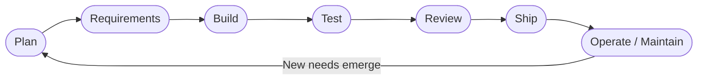
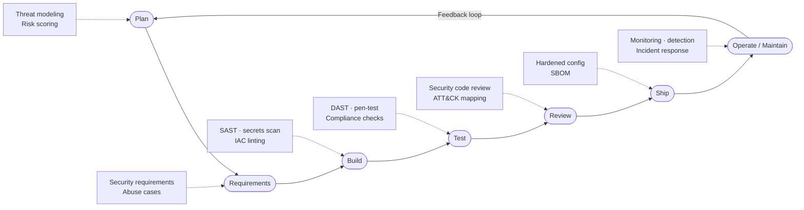
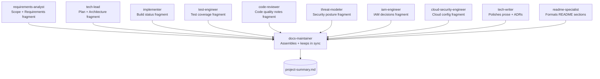

# Token Best Practices

> CLI cheat sheets and quick-reference commands live in [readmecli.md](readmecli.md).

---

## 1. What this guide is / how to read it

This guide is for developers who are new to working with AI coding assistants (like Claude Code) and want to use them efficiently. You do not need prior experience with AI systems — every concept is explained from scratch before any jargon is used.

**How the "Your setup" callouts work**

Throughout this guide you will see blockquotes titled **"🔧 Your setup"**. Each one takes a concept that was just explained generically and maps it to your real environment — your actual file paths, agent names, and tool IDs. You can read the guide without them and still understand everything; read them when you want to see exactly how the idea applies to you.

---

## 2. Why token efficiency matters

**What is a token?** A token is a small chunk of text — roughly 3–4 characters or about 3/4 of a word in English. AI models do not read text the way you do; they process streams of tokens. Every word you type in a prompt, and every word the model writes back, costs tokens.

**What is a context window?** The context window is the model's working memory for a single conversation. It has a fixed maximum size. Once a conversation fills the window, older content gets pushed out and the model can no longer "see" it. A typical large window today is 200 000 tokens — sounds enormous, but large codebases, long conversations, and repeated file reads consume it quickly.

**Why does this cost money?** Cloud AI APIs charge per token — both tokens you send (input) and tokens the model generates (output). Output tokens cost more than input tokens. Wasting tokens on redundant content is wasting budget.

**Why does it slow things down?** Larger prompts take longer to process. If you send a 50 000-token context when 5 000 tokens would do, every step is 10x slower.

**The 5-minute prompt-cache TTL** — A cache TTL (Time To Live) is the window during which the AI provider stores the processed version of your prompt. While the cache is warm (within 5 minutes of your last call), subsequent requests that share the same context prefix are processed faster and cost fewer tokens. If you pause for more than 5 minutes between steps in a workflow, the cache expires and the next call re-reads everything from scratch — slower and more expensive.

### What wastes tokens vs. the efficient habit

| What wastes tokens | The efficient habit |
|---|---|
| Re-reading a file you just edited | Trust that the edit succeeded; move on |
| Pasting an entire file when you only need one function | Ask for or reference only the relevant section |
| Asking broad, open-ended questions mid-task | Plan first; ask specific, scoped questions |
| Starting an agent task without context | Give agents the exact context they need up front |
| Waiting more than 5 minutes between chained steps | Keep momentum; chain steps while the cache is warm |
| One long session covering unrelated tasks | Use `/clear` between unrelated tasks to reset context |
| Dumping raw file trees instead of conclusions | Use search agents that return summaries, not raw dumps |

---

## 3. The SDLC in layman steps (with graphs)

**What is the SDLC?** SDLC stands for Software Development Life Cycle. It is the structured sequence of phases a software project goes through from first idea to running product. Different teams label these phases slightly differently; the version below is a practical one.



The cycle loops. Once the product is live and you learn from real users, you discover new requirements and the whole cycle starts again.

**What is DevSecOps?** DevSecOps is the practice of weaving security checks into every phase of the SDLC rather than bolting them on at the end. "Shift-left" means moving security gates earlier (further left on the timeline), where fixing problems is cheapest. A bug caught during design costs almost nothing; the same bug caught after launch can cost thousands of hours.



Dotted arrows show security gates being injected at every phase rather than only at Test or Ship.

---

## 4. Engineer bots across the SDLC and DevSecOps

**What is an engineer bot / subagent?** A subagent is a pre-configured AI assistant with a single job. Think of each one as a specialist contractor: you hand them a well-scoped task, they do it, and they hand results back. Each subagent has its own instructions, allowed tools, and model choice baked in. You interact with them from the main conversation — the main chat acts as the project manager.

### SDLC and DevSecOps phase → agent owner

| SDLC Phase | DevSecOps Gate | Primary Agent | Role type |
|---|---|---|---|
| Plan | Risk scoring, threat model scope | tech-lead, threat-modeler | Planner / Security |
| Requirements | Abuse cases, security requirements | requirements-analyst, iam-engineer | Authoring |
| Build | SAST, secrets scan, IaC lint | implementer, cloud-security-engineer, detection-engineer | Doer |
| Test | DAST, compliance, ATT&CK coverage | test-engineer, detection-engineer | Doer |
| Review | Security code review, ATT&CK mapping | code-reviewer, security-architect, threat-modeler | Read-only / Advisory |
| Ship | Hardened config, SBOM, CI/CD gates | devops-engineer, cloud-security-engineer | Doer |
| Operate / Maintain | Monitoring, detection, incident response | incident-responder, detection-engineer, docs-maintainer | Doer / Docs |
| Cross-cutting | Advisory and policy across all phases | security-architect | Advisory |
| Cross-cutting | Documentation and drift audits | tech-writer, readme-specialist, docs-maintainer | Docs |

> **🔧 Your setup**
>
> Your bench has 16 agents stored at `C:\Users\<username>\.claude\agents\*.md` (user scope — available in every project). Manage them with the `/agents` command from the Claude Code CLI.
>
> **Security (6):**
> - `security-architect` — advisory + authoring; model `claude-opus-4-8`
> - `threat-modeler` — produces Mermaid DFD + STRIDE table + attack tree; model `claude-opus-4-8`
> - `detection-engineer` — KQL/Sigma/ATT&CK; model `claude-sonnet-4-6`
> - `iam-engineer` — identity and access; model `claude-sonnet-4-6`
> - `cloud-security-engineer` — AWS/Azure/GCP/K8s vs CIS; model `claude-sonnet-4-6`
> - `incident-responder` — NIST 800-61/PICERL; model `claude-opus-4-8`
>
> **Dev/SDLC (7):**
> - `requirements-analyst` — Plan phase authoring; model `claude-sonnet-4-6`
> - `tech-lead` — read-only planner only; model `claude-opus-4-8`
> - `implementer` — Build phase doer; model `claude-sonnet-4-6`
> - `debugger` — doer; model `claude-sonnet-4-6`
> - `test-engineer` — doer; model `claude-sonnet-4-6`
> - `code-reviewer` — read-only; model `claude-sonnet-4-6`
> - `devops-engineer` — CI/CD and release; model `claude-sonnet-4-6`
>
> **Docs (3):**
> - `tech-writer` — guides, API docs, ADRs, inline comments; model `claude-sonnet-4-6`
> - `readme-specialist` — README and markdown craft; model `claude-sonnet-4-6`
> - `docs-maintainer` — keeps docs in sync, changelogs, drift audits; model `claude-sonnet-4-6`

---

## 5. Agent structure (anatomy of a subagent)

Every subagent is a Markdown file. The file has a YAML frontmatter block at the top (the part between `---` lines) that controls how the agent behaves. Below that is a free-text body that acts as the agent's system prompt — its standing instructions.

Here is an annotated example showing what each field means:

```markdown
---
name: example-analyst          # Unique identifier; used when you invoke the agent
description: |
  Use this agent when you need to analyse requirements and produce a scope document.
  Prefer this agent over tech-lead when you need written deliverables, not a plan table.
  Do NOT use for writing code or running terminal commands.
  # ^^^ The description is written to help Claude auto-select the right agent.
  # It says WHEN to use it AND when to prefer a different one.

model: claude-sonnet-4-6       # Which model runs this agent (see Section 7)

tools:                         # Least-privilege: only what this agent actually needs
  - Read                       # Can read files
  # No Write, Edit, or Bash — this agent is authoring/advisory only
  # Giving fewer tools = smaller attack surface + cheaper token use
---

You are a requirements analyst. Your single responsibility is to read a project
brief and produce a structured requirements document. You do not write code.
You do not run commands. You output Markdown only.

Always ask for clarification before assuming scope.
```

**Key concepts in agent anatomy**

- **`description`** — This is the most important field. Claude reads descriptions across all agents to decide which one to call when you use auto-selection. Write it to answer: "when should I pick this agent, and when should I pick someone else?"
- **`tools` (least privilege)** — Least privilege means giving each agent only the permissions it genuinely needs. A documentation agent has no reason to run Bash. Restricting tools limits accidental damage and reduces token overhead from unused capability descriptions.
- **`model`** — Routes the task to the right model tier (see Section 7). Deep-reasoning tasks get Opus; everyday tasks get Sonnet.
- **Single responsibility** — Each agent does one thing. This makes outputs predictable and makes it easy to swap or upgrade one agent without breaking others.
- **Cold start** — Agents have no memory between invocations. Every time you call an agent, it starts fresh with zero knowledge of past conversations. You must give it all the context it needs in the invocation message.

> **🔧 Your setup**
>
> Invocation grammar from your main chat:
> *"Use the `<name>` subagent to `<self-contained task>`"*
>
> Because agents start cold, always include in your invocation: the file path(s) to read, the goal, and any decisions already made. Do not assume the agent remembers anything from earlier in your session.

---

## 6. Planner considerations

**The golden rule: agents cannot dispatch other agents.** A subagent cannot call another subagent. The main conversation is the only orchestrator. If you nest agents (Agent A tells Agent B to call Agent C), the chain will silently break.

**The tech-lead is a read-only planner.** Its job is to look at a goal and produce a structured delegation plan — a table that tells the main thread what to do, in what order, and what can happen in parallel. It does not write code, edit files, or run commands. It only plans.

**Why parallel steps matter for tokens.** Independent steps that are fired at the same time share the same cache-warm window. Steps fired sequentially each pay the cache re-read cost if more than 5 minutes pass between them.

### Example delegation plan table

When you ask the tech-lead to plan, it should produce something like this:

| Step | Specialist | Task | Depends on | Parallel? |
|---|---|---|---|---|
| 1 | requirements-analyst | Draft scope doc from project brief | — | Yes (with step 2) |
| 2 | threat-modeler | Produce initial threat model from project brief | — | Yes (with step 1) |
| 3 | tech-lead | Review scope + threat model; produce architecture plan | Steps 1, 2 | No |
| 4 | implementer | Build auth module per architecture plan | Step 3 | Yes (with step 5) |
| 5 | iam-engineer | Define IAM roles for auth module | Step 3 | Yes (with step 4) |
| 6 | test-engineer | Write tests for auth module | Steps 4, 5 | No |
| 7 | code-reviewer | Review implementation and tests | Step 6 | No |
| 8 | docs-maintainer | Update project-summary.md to reflect new module | Step 7 | No |

After the table, the tech-lead should output copy-paste invocation lines so you can fire each step directly from the main thread.

**How to execute the plan**

1. Fire all "Parallel? = Yes" steps in the same message (or in rapid succession while cache is warm).
2. Wait for those to complete.
3. Fire the next sequential step, passing in the outputs from the completed steps as context.
4. Repeat.

> **🔧 Your setup**
>
> Your `tech-lead` agent runs on `claude-opus-4-8` (deepest reasoning — appropriate for architectural decisions). It is strictly read-only: its `tools` list contains no Write, Edit, or Bash. When you get its delegation plan table, you are the one who fires each line. The main Claude Code chat window is your orchestrator.

---

## 7. Model routing strategy

**The three model tiers** (use these exact IDs in your config — do not just say "the smart one"):

| Model | ID | Strengths | When to use |
|---|---|---|---|
| Opus 4.8 | `claude-opus-4-8` | Deepest reasoning, complex multi-step logic, architectural judgment | Threat modeling, planning, incident response, security architecture |
| Sonnet 4.6 | `claude-sonnet-4-6` | Balanced speed + quality, solid code generation and authoring | Most everyday coding, documentation, IAM, cloud security checks, CI/CD |
| Haiku 4.5 | `claude-haiku-4-5-20251001` | Fast, cheapest, good at simple classification and bulk tasks | Labeling, sorting, quick lookups, pre-filtering before a deeper agent runs |
| Fable 5 | `claude-fable-5` | Specialist creative/narrative tasks | Narrative content, not engineering tasks |

**The cost/latency/quality triangle** — You cannot have all three at once. Opus gives the best quality but costs the most and takes the longest. Haiku is the fastest and cheapest but will struggle with complex reasoning. Sonnet is the everyday workhorse that sits in the middle.

### Decision table: task type → model

| Task type | Recommended model | Why |
|---|---|---|
| Threat modeling, attack trees, STRIDE | `claude-opus-4-8` | Requires deep adversarial reasoning across many interacting facts |
| Architectural planning, delegation | `claude-opus-4-8` | Multi-step judgment with long-range dependencies |
| Incident response triage | `claude-opus-4-8` | High-stakes decisions; quality over speed |
| Writing code (implementer, devops) | `claude-sonnet-4-6` | Good code quality at reasonable cost |
| Documentation authoring | `claude-sonnet-4-6` | Reliable prose without over-paying |
| IAM policy authoring | `claude-sonnet-4-6` | Structured output; Sonnet handles well |
| KQL/Sigma rule writing | `claude-sonnet-4-6` | Pattern-heavy; Sonnet is accurate |
| Pre-filtering a large file list | `claude-haiku-4-5-20251001` | Simple classification; Haiku is fast and cheap |
| Bulk log triage (first pass) | `claude-haiku-4-5-20251001` | Speed matters; escalate hits to Sonnet/Opus |
| Checking if a file is relevant | `claude-haiku-4-5-20251001` | Yes/no classification; no deep reasoning needed |

> **🔧 Your setup**
>
> Your bench already implements this routing correctly:
> - **Opus** (`claude-opus-4-8`): `security-architect`, `threat-modeler`, `tech-lead`, `incident-responder` — all deep-reasoning roles.
> - **Sonnet** (`claude-sonnet-4-6`): the remaining 12 agents — everyday doers, authors, and reviewers.
> - **Haiku** (`claude-haiku-4-5-20251001`): not currently assigned to any agent on your bench, but it is a good candidate if you add a bulk-triage or file-classification agent in the future. For now, your Sonnet agents handle those tasks.

---

## 8. The agent tree that builds `project-summary.md`

`project-summary.md` is a single source of truth for a project: what it does, what decisions were made, what the current status is, and what comes next. Multiple specialist agents each contribute a fragment; the docs agents assemble and maintain the whole.



**Worked example — how this flows in practice**

1. You start a new project. You ask `tech-lead` to plan. It outputs a delegation table (see Section 6).
2. You fire `requirements-analyst` and `threat-modeler` in parallel (both read the same project brief; neither depends on the other).
3. `requirements-analyst` returns a scope/requirements fragment. `threat-modeler` returns a Mermaid DFD, STRIDE table, and attack tree.
4. You pass both fragments to `tech-lead` for an architecture plan.
5. As the project progresses, `implementer`, `test-engineer`, and `code-reviewer` each generate status fragments after their phases complete.
6. At any milestone, you invoke `docs-maintainer` with all fragments and tell it to assemble or update `project-summary.md`.
7. `docs-maintainer` keeps the file current on an ongoing basis — flagging drift between the docs and the actual codebase when you ask it to audit.

---

## 9. How to build a project summary from a repo memory file

**What is a memory file?** Memory files are short Markdown files where durable facts about a project are stored between sessions. Because AI agents start cold, these files are how you persist knowledge. They are plain text you (or an agent) write and an agent reads at the start of a task.

### Step 1 — Locate your memory files

Your memory system has two layers:

- **Index**: `MEMORY.md` — a table of contents listing every fact file and a one-line description.
- **Fact files**: `memory/*.md` — one file per topic. Each has YAML frontmatter:
  ```yaml
  ---
  name: "short-identifier"
  description: "One sentence about what this file contains"
  metadata:
    type: user | feedback | project | reference
  ---
  ```

### Step 2 — Extract the durable facts

Read `MEMORY.md` first to understand what exists. Then read only the fact files relevant to the project you are documenting. Do not read every file if most are unrelated — that wastes tokens.

### Step 3 — Structure `project-summary.md`

Use this template as a starting point. Adjust sections to fit the project.

```markdown
# Project Summary: <Project Name>

_Last updated: <date> by <agent or author>_

## Overview
One paragraph: what the project does, for whom, and why it exists.

## Scope
What is in scope. What is explicitly out of scope.

## Architecture
Key technical decisions. Stack, major components, integrations.
Link to or embed the threat-modeler's DFD here.

## Status
| Phase | Status | Notes |
|---|---|---|
| Requirements | Done | See requirements-analyst output |
| Build | In progress | Auth module complete; API layer pending |
| Testing | Not started | — |

## Decisions / ADRs
List of Architecture Decision Records (ADRs — documented choices with rationale).
- ADR-001: Chose Azure Sentinel over Splunk because...
- ADR-002: IAM roles scoped per workload because...

## Security Posture
Summary from threat-modeler. STRIDE findings. Open risks.

## Risks and Mitigations
| Risk | Likelihood | Impact | Mitigation |
|---|---|---|---|
| ... | ... | ... | ... |

## Next Steps
Prioritized list of what happens next, with owner assignments.
```

### Step 4 — Keep it in sync

Assign ongoing maintenance to `docs-maintainer`. Invoke it after each significant phase: *"Use the `docs-maintainer` subagent to audit `project-summary.md` against the current state of the repo and update any sections that have drifted."*

> **🔧 Your setup**
>
> Your memory layout lives at `C:\Users\<username>\.claude\projects\c--Users-<username>\memory\`. The index is `MEMORY.md`; fact files follow the pattern `memory/<topic>.md` with YAML frontmatter fields `name`, `description`, and `metadata.type`.
>
> When building a project summary, give `docs-maintainer` the index path so it can selectively read only the relevant fact files. Example invocation:
>
> *"Use the `docs-maintainer` subagent to read `C:\Users\<username>\.claude\projects\c--Users-<username>\memory\MEMORY.md`, identify the fact files relevant to [project name], and draft a `project-summary.md` using the standard template."*

---

## 10. Token-efficiency cheat sheet

- **Scope agents tightly.** One agent, one task, one clear output. Vague instructions produce bloated outputs that cost more to read and re-process.
- **Batch independent tool calls in parallel.** If two agents do not depend on each other's output, fire them at the same time. This keeps you inside the 5-minute cache window and halves wall-clock time.
- **Ask for conclusions, not file dumps.** When searching a codebase, ask an agent to return a summary and the relevant file paths — not the raw content of every file it read.
- **Do not re-read files you just edited.** The edit tool reports success or error. If it succeeded, the file is correct. Re-reading it costs tokens for no gain.
- **Respect the 5-minute cache window.** Chain dependent steps without long pauses. If you need to stop, it is cheaper to restart the next session fresh than to keep a stale session alive.
- **Plan before building.** A 10-token plan question to `tech-lead` can prevent a 10 000-token re-implementation later.
- **Use `/clear` between unrelated tasks.** Starting a new task in a long existing conversation carries the full weight of everything said before. Clear it.
- **Let context compaction handle long sessions.** Claude Code's compaction summarizes old context automatically. Do not fight it by pasting large files to "remind" the model — trust the compaction and give targeted context instead.
- **Use Haiku for bulk pre-filtering.** Run a cheap Haiku pass to classify or filter a large set, then pass only the relevant subset to Sonnet or Opus.
- **Write good agent descriptions.** A precise description means Claude auto-selects the right agent on the first try instead of calling the wrong one and having to re-route.

---

## 11. Glossary

**Token** — The smallest unit of text an AI model processes. Roughly 3–4 characters or 3/4 of a word. Both your input and the model's output are measured in tokens. APIs charge per token.

**Context window** — The model's working memory for one conversation. Has a fixed maximum size. When full, the oldest content is dropped and the model can no longer reference it.

**Subagent (engineer bot)** — A pre-configured AI assistant with a single job, its own instructions, a restricted tool set, and a chosen model. Invoked from the main conversation. Starts cold each time.

**MCP (Model Context Protocol)** — A standard that lets AI assistants connect to external tools and data sources (like your filesystem, GitHub, or a memory store) through a defined interface. Your setup uses filesystem, memory, and GitHub MCPs.

**Orchestrator** — The entity that decides which agents to call, in what order, and with what inputs. In your setup, the main Claude Code conversation is always the orchestrator. Agents cannot orchestrate other agents.

**Prompt cache** — A provider-side optimization that stores the processed form of a prompt prefix so repeated calls reuse it instead of re-processing it. The cache expires after 5 minutes (TTL = Time To Live). Working within the TTL makes chained steps faster and cheaper.

**SDLC (Software Development Life Cycle)** — The structured sequence of phases a software project moves through: Plan, Requirements, Build, Test, Review, Ship, Operate/Maintain. It loops — each cycle of learning feeds the next.

**DevSecOps** — The practice of integrating security checks into every SDLC phase from the start, rather than running security reviews only at the end. "Shift-left" means moving those checks earlier in the cycle.

**Least privilege** — A security principle: give any system, agent, or user only the minimum permissions needed to do their job — no more. Applied to agents, this means only listing the tools they genuinely require in their config.

**Cold start** — An agent has no memory of previous conversations. Every invocation begins from zero. You must provide all necessary context in the invocation message itself — file paths, prior decisions, relevant outputs from earlier steps.

**ADR (Architecture Decision Record)** — A short document that captures a significant technical decision: what was decided, why, and what the trade-offs are. ADRs create an audit trail so future team members (or future you) understand why things are built the way they are.
